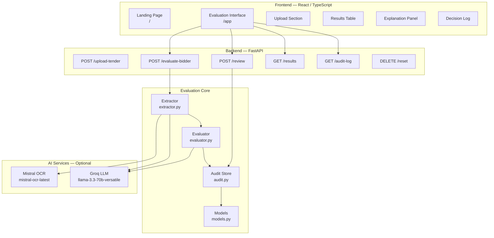
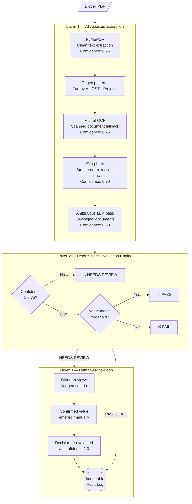
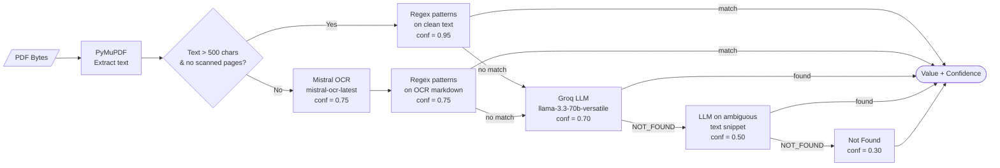

<div align="center">

# TenderAI

### AI-Assisted Tender Evaluation for Government Procurement

[](https://www.python.org/)
[](https://fastapi.tiangolo.com/)
[](https://react.dev/)
[](https://www.typescriptlang.org/)
[](https://tailwindcss.com/)
[](LICENSE)

**Explainable · Auditable · Human-in-the-Loop**

[Live Demo](https://neon-dodol-3d56d3.netlify.app) · [API Docs](https://neon-dodol-3d56d3.netlify.app/docs) · [Report an Issue](https://github.com/sudo-Harshk/tender-ai/issues)

</div>

---

## Overview

TenderAI is a full-stack decision-support system that automates the eligibility screening phase of government tender evaluation. It extracts structured data from bidder PDFs, applies deterministic pass/fail logic, and routes uncertain cases to a human procurement officer  with every decision timestamped and logged for compliance.

**The core guarantee:** AI is used only for data extraction and natural-language explanation generation. Pass, Fail, and Needs Review verdicts are always produced by deterministic if/else logic - never by an AI model.

### The Problem

Government procurement officers in India manually verify dozens of bidder documents per tender. Each document must be checked against criteria like annual turnover thresholds, GST registration, and prior project experience. This process is:

- **Slow** — hours of manual PDF reading per evaluation cycle
- **Inconsistent** — subjective interpretation of ambiguous text
- **Hard to audit** — paper trails are incomplete or scattered

### The Solution

TenderAI handles the extraction and first-pass evaluation automatically, surfacing only genuinely ambiguous cases for human review. Every decision — automated or human - is recorded in an immutable audit log.

---

## Architecture

### System Overview



### Three-Layer Evaluation Pipeline



### Extraction Fallback Chain



---

## Tech Stack

| Layer | Technology |
|---|---|
| **API Framework** | FastAPI 0.111 + Uvicorn |
| **PDF Extraction** | PyMuPDF (fitz) |
| **OCR** | Mistral AI `mistral-ocr-latest` |
| **LLM** | Groq `llama-3.3-70b-versatile` |
| **Frontend** | React 18 + Vite + TypeScript |
| **Styling** | Tailwind CSS 3 + IBM Plex Sans |
| **Icons** | Lucide React |
| **Routing** | React Router v6 |
| **Data Validation** | Pydantic v2 |
| **Environment** | python-dotenv |

Both AI services are **optional** - the system falls back to deterministic logic when API keys are absent.

---

## Evaluation Criteria

The demo is pre-configured with three standard eligibility criteria for government construction tenders:

| ID | Criterion | Threshold | Mandatory |
|----|-----------|-----------|-----------|
| C1 | Annual Turnover | ≥ ₹5 Crore | Yes |
| C2 | Valid GST Registration | Present | Yes |
| C3 | Similar Projects Completed | ≥ 2 | Yes |

### Confidence Model

| Extraction Method | Confidence Score |
|---|---|
| Regex on clean PDF text | `0.95` |
| Regex on Mistral OCR output | `0.75` |
| Groq LLM structured extraction | `0.70` |
| LLM on ambiguous/low-signal text | `0.50` |
| Value not found | `0.30` |

**Confidence gate:** Any criterion with confidence `< 0.75` receives `NEEDS REVIEW` instead of `FAIL`. This prevents valid bidders from being wrongly rejected when a document is poorly scanned or ambiguously formatted.

---

## Project Structure

```
tender-ai/
├── backend/
│   ├── main.py              # FastAPI app + route definitions
│   ├── extractor.py         # PDF text extraction + value extraction (fallback chain)
│   ├── evaluator.py         # Deterministic evaluation engine + explanation generation
│   ├── audit.py             # In-memory audit log + human review handler
│   ├── models.py            # Pydantic models: BidderResult, CriterionResult, AuditEntry
│   ├── generate_samples.py  # Sample PDF generator for demos
│   └── requirements.txt
├── frontend/
│   ├── src/
│   │   ├── components/
│   │   │   ├── UploadSection.tsx    # Tender upload + bidder name input
│   │   │   ├── ResultsTable.tsx     # Evaluated bidder results table
│   │   │   ├── ExplanationPanel.tsx # Per-criterion breakdown + review form
│   │   │   ├── DecisionLog.tsx      # Immutable audit trail table
│   │   │   └── ui/                  # Reusable Button, Card primitives
│   │   ├── pages/
│   │   │   └── LandingPage.tsx      # Hackathon landing / product story
│   │   ├── App.tsx          # Root state + layout
│   │   ├── api.ts           # Typed fetch wrappers for all backend routes
│   │   └── types.ts         # TypeScript types mirroring backend Pydantic models
│   ├── tailwind.config.js
│   ├── vite.config.ts
│   └── package.json
├── sample_data/             # Drop test PDFs here (.gitkeep preserves directory)
├── .env.example
└── README.md
```

---

## Getting Started

### Prerequisites

| Requirement | Version |
|---|---|
| Python | 3.10+ |
| Node.js | 18+ |
| Mistral API Key | Optional — [console.mistral.ai](https://console.mistral.ai) |
| Groq API Key | Optional — [console.groq.com](https://console.groq.com) |

Both API keys are free-tier. Without them, the system still works using regex extraction and deterministic fallback explanations.

### Step 1 — Clone and Configure

```bash
git clone https://github.com/sudo-Harshk/tender-ai.git
cd tender-ai
cp .env.example .env
```

Edit `.env` and add your keys:

```env
MISTRAL_API_KEY=your_mistral_api_key_here
GROQ_API_KEY=your_groq_api_key_here
```

### Step 2 — Backend Setup

```bash
cd backend

# Create and activate virtual environment
python -m venv venv
venv\Scripts\activate          # Windows
# source venv/bin/activate     # macOS / Linux

pip install -r requirements.txt

# Start the API server
uvicorn main:app --reload --port 8000
```

The API will be available at `http://localhost:8000`. Interactive documentation is at `http://localhost:8000/docs`.

### Step 3 — Frontend Setup

```bash
cd frontend
npm install
npm run dev
```

The application will open at `http://localhost:5173`.

| Route | Description |
|---|---|
| `/` | Product landing page |
| `/app` | Evaluation interface |

---

## API Reference

| Method | Endpoint | Description |
|--------|----------|-------------|
| `POST` | `/upload-tender` | Upload a tender PDF; returns pre-configured criteria |
| `POST` | `/evaluate-bidder` | Upload a bidder PDF + name; returns full `BidderResult` |
| `GET` | `/results` | All evaluated bidders in the current session |
| `POST` | `/review` | Submit human review for a `NEEDS REVIEW` criterion |
| `GET` | `/audit-log` | Full timestamped audit trail |
| `DELETE` | `/reset` | Clear in-memory session data |

### Example: Evaluate a Bidder

```bash
curl -X POST http://localhost:8000/evaluate-bidder \
  -F "file=@acme_constructions.pdf" \
  -F "bidder_name=Acme Constructions"
```

**Response:**

```json
{
  "bidder_id": "A3F2B1C8",
  "bidder_name": "Acme Constructions",
  "overall_decision": "FAIL",
  "evaluated_at": "2025-05-17T10:30:00Z",
  "criteria_results": [
    {
      "criterion_id": "C1",
      "criterion_label": "Annual Turnover >= 5 Crore",
      "extracted_value": 31000000,
      "extracted_display": "₹3.10 Cr",
      "required_value": "₹5 Crore",
      "confidence": 0.95,
      "decision": "FAIL",
      "explanation": "Turnover of ₹3.10 Cr falls below the required ₹5 Crore threshold — marked as FAIL."
    }
  ]
}
```

### Example: Submit a Human Review

```bash
curl -X POST http://localhost:8000/review \
  -H "Content-Type: application/json" \
  -d '{
    "bidder_id": "A3F2B1C8",
    "criterion_id": "C1",
    "confirmed_value": "6.2 Crore",
    "reviewer_name": "Officer Sharma"
  }'
```

---

## Demo Walkthrough

The included sample PDFs demonstrate all three evaluation outcomes:

| Bidder | Turnover | GST | Projects | Outcome |
|--------|----------|-----|----------|---------|
| Acme Constructions | ₹3.1 Cr | Valid | 3 | **FAIL** - turnover below threshold |
| BuildRight Pvt Ltd | ₹6.2 Cr | Valid | 5 | **PASS** - all criteria met |
| Sharma Enterprises | Unclear | Valid | 4 | **NEEDS REVIEW** → Officer enters ₹6.2 Cr → **PASS** |

### How to Run It

1. Open `http://localhost:5173/app`
2. Upload any PDF as the tender document (criteria are pre-configured)
3. Upload a bidder PDF and enter the bidder name → **Run Evaluation**
4. Click any row in the results table to expand the per-criterion breakdown
5. For **NEEDS REVIEW** rows — enter the confirmed value and your name → **Submit Review**
6. The **Decision Log** panel shows the full timestamped audit trail for every action

---

## Design Principles

**AI is never the decision-maker.**
Pass, Fail, and Needs Review outcomes are produced entirely by deterministic threshold comparisons (`evaluator.py`). AI models handle only two tasks: value extraction from unstructured text, and natural-language explanation generation.

**Confidence gating prevents false rejections.**
A low-confidence extraction (ambiguous scan, missing data) escalates to `NEEDS REVIEW`, not `FAIL`. This ensures a valid bidder with a poorly scanned document is never automatically excluded.

**The audit log is append-only.**
Every automated decision and every human override appends a new `AuditEntry`. Nothing is deleted or modified in the log, providing a complete compliance trail.

**Graceful degradation.**
Both Mistral OCR and Groq LLM are optional. If either key is missing or a call fails, the system silently falls back to the next method in the chain without surfacing errors to the user.

---

## Roadmap

- [ ] Dynamic criteria extraction from the tender PDF itself
- [ ] Integration with GeM / NIC eProcurement portals
- [ ] Multi-language document support (Hindi, regional languages)
- [ ] Role-based access control with officer authentication
- [ ] Persistent storage — PostgreSQL or SQLite backend
- [ ] Audit export to signed PDF for regulatory submission
- [ ] Batch evaluation — process all bidders from a ZIP upload

---

## License

This project is licensed under the [MIT License](LICENSE).

---

<div align="center">

Built for the **AI for Bharat Hackathon** by [Harsha K](https://github.com/sudo-Harshk)

</div>
